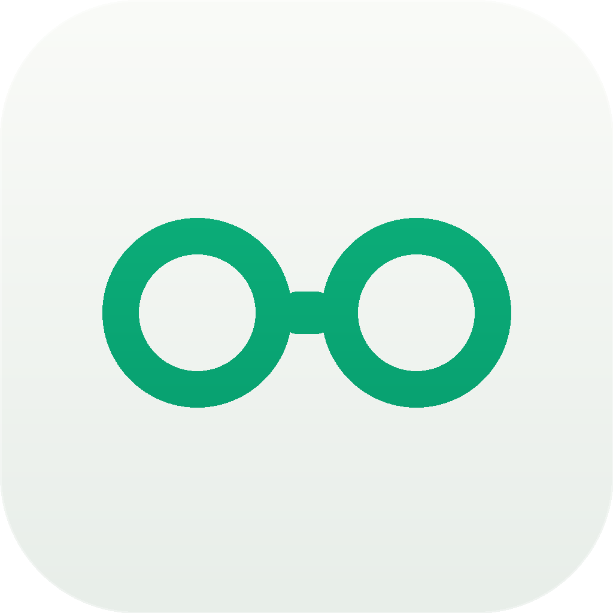
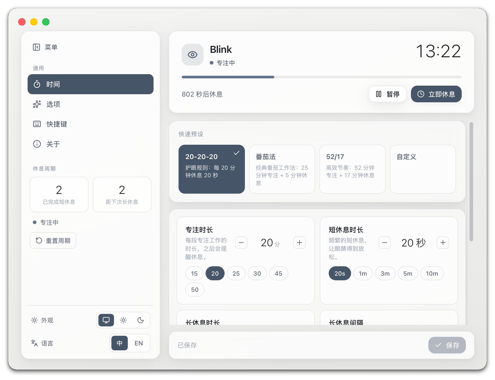
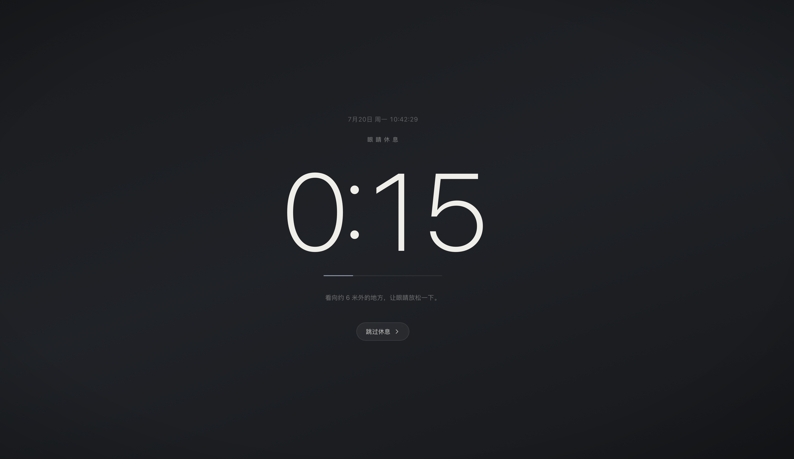
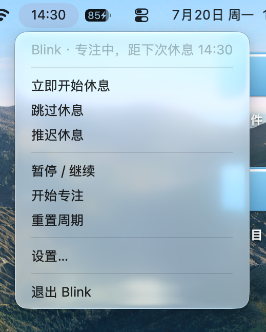

<p align="center">
  
</p>

<h1 align="center">Blink</h1>
<p align="center">
  <strong>Mac 智能护眼休息提醒 · 让 20-20-20 规则成为习惯</strong>
</p>

<p align="center">
  <a href="./README.en.md">English</a> · 简体中文
</p>

---

<p align="center">
  
</p>

## ✨ 为什么需要 Blink？

长时间盯着屏幕，眼睛的睫状肌持续收缩，是视疲劳、干眼、视力下降的主要诱因之一。眼科医生推荐的 **[20-20-20 规则](https://www.aoa.org/healthy-eyes/caring-for-your-eyes/protecting-your-eyes/20-20-20-rule)** 非常简单：

> **每用屏 20 分钟 → 看 20 英尺（约 6 米）外 → 坚持 20 秒**

道理谁都懂，但**没人能坚持记住**。

Blink 把这件事变成自动化的——它住在你的菜单栏里，默默计时，到点就温柔地提醒你抬起头。你只需要跟着做，其他交给它。

## 🎯 核心亮点

| 功能 | 说明 |
| --- | --- |
| 🧭 **首次引导** | 启动后进入引导界面，完成配置才正式开始——不会一装上就弹窗吓到你 |
| ⏱️ **菜单栏实时倒计时** | 图标旁显示距下次休息还剩多久，心里有数 |
| 🔄 **专注 → 预警 → 休息** 循环 | 频繁短休息 + 偶尔长休息，节奏自然不割裂 |
| 🖥️ **全屏覆盖层** | 覆盖所有显示器（多屏感知），大号倒计时 + 提示音，想忽略都难 |
| 🔔 **休息前预警** | 屏幕变暗前先弹通知，给你时间收尾手头的活 |
| 😴 **空闲感知** | 人离开就暂停，回来继续；系统休眠后自动恢复 |
| ⌨️ **全局快捷键** | 开始 / 跳过 / 推迟 / 设置，手不离键盘 |
| 🎨 **完全可配置** | 时长、频率、快捷键、外观、语言，一切可调 |
| 🌐 **中英双语** | 默认跟随系统语言，随时切换 |

## 📸 应用截图

### 全屏休息倒计时

<p align="center">
  
</p>

深色沉浸式全屏覆盖层，大号倒计时居中显示，附带护眼提示语和跳过按钮。休息结束时播放清脆提示音。

### 休息预警

<p align="center">
  
</p>

屏幕变暗前的最后一道防线——玻璃质感的预警卡片，告诉你还有几秒进休息，可以推迟或等待。

### 菜单栏

<p align="center">
  
</p>

点击菜单栏图标即可：立即休息、跳过、推迟、暂停/继续、重置周期、打开设置或退出。顶部显示当前状态和下次休息时间。

### 设置面板

<p align="center">
  
</p>

分栏式设置面板：时间（预设方案 + 自定义滑块）、选项、快捷键、关于。支持番茄法、高效节奏等多种内置方案。

## 🚀 快速开始

### 从 DMG 安装（推荐）

1. 从 [Releases](../../releases) 下载最新 `Blink-<version>-arm64.dmg`（Apple Silicon）或 `-amd64.dmg`（Intel）
2. 打开 `.dmg`，将 **Blink** 拖入 **应用程序**
3. 在 Finder 中右键 Blink → **打开** → 确认打开（仅需首次）

> ⚠️ 应用采用临时签名（非 Apple Developer ID），首次需通过「右键→打开」绕过 Gatekeeper。之后正常双击即可启动。

### 从源码构建

```bash
# 克隆仓库
git clone https://github.com/<your-org>/PocketMind.git
cd PocketMind

# 安装前端依赖
pnpm install

# 开发模式（热重载）
wails3 dev -config ./build/config.yml

# 生产构建
wails3 build                    # -> bin/blink
wails3 task package             # -> bin/blink.app（临时签名）
wails3 task darwin:dmg          # -> bin/Blink-<version>-<arch>.dmg
```

### 系统要求

- **macOS 12.0 Monterey** 或更高版本
- Apple Silicon (M1/M2/M3/M4/M5) 或 Intel Mac

## 🛠️ 技术栈

| 层 | 技术 |
| --- | --- |
| 桌面框架 | [Wails v3](https://v3.wails.io) |
| 后端语言 | Go |
| 前端框架 | Vue 3 + TypeScript |
| UI 样式 | Tailwind CSS v4 |
| 国际化 | vue-i18n |
| 设计风格 | Slate 石板灰体系 — 单色无渐变，沉稳不打扰 |

## 📦 架构概览

```
├── main.go                 # 入口 & Wails 应用初始化
├── tray.go                 # 菜单栏托盘 + 下拉菜单（含 i18n）
├── shortcuts.go            # 全局快捷键注册
├── prefs.go                # 设置窗口管理
├── breakservice.go         # 前端调用的 Wails Service（引导门控 + 引擎控制）
│
├── internal/
│   ├── breakengine/        # 计时状态机（阶段转换、空闲检测、睡眠恢复）
│   ├── config/             # 设置结构体 + JSON 持久化
│   └── platform/           # CGo：macOS 空闲时间 + NSSound 提示音
│
└── frontend/src/
    ├── views/              # Settings / BreakOverlay / PreBreakNotice
    ├── components/         # 玻璃面板组件库
    └── locales/            # 中英文语言包
```

## 📋 快捷键一览

| 快捷键 | 功能 |
| --- | --- |
| `Cmd+Shift+B` | 立即开始休息 |
| `Cmd+Shift+,` | 打开设置 |
| `Cmd+Shift+/` | 跳过当前休息 |
| `Cmd+Shift+.` | 推迟休息 |

> 可在设置面板中自定义。

## 🗺️ 路线图

- [x] 会议/通话检测 —— 视频会议时自动暂停
- [x] 媒体播放检测 —— 看视频时自动暂停
- [x] 统计面板 —— 每日/每周休息完成率
- [x] Windows / Linux 支持
- [ ] Apple Developer ID 签名 + 公证

## 🤝 参与贡献

欢迎 Issue 和 PR！开发前建议先跑一下：

```bash
pnpm install        # 安装前端依赖
wails3 dev          # 启动热重载开发服务器
```

## 📄 许可证

[MIT](./LICENSE)

© 2026 Blink. Free and open source.
